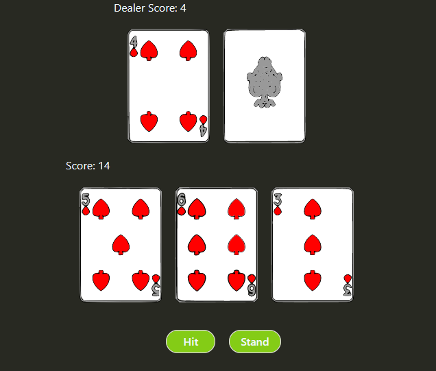
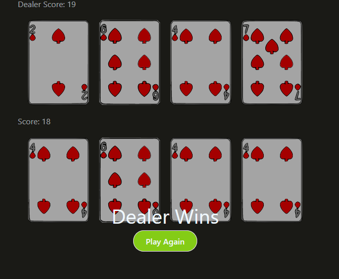

The first thing that I did after reading about React.js for about an hour. A "Blackjack" game/thing, I don't know if it works like a blackjack game because I don't know the rules. But it looks like one and kinda behaves like one so I take it as a win.




---

## Getting Started

First, run the server:

```bash
npm run dev
```

Then open [http://localhost:3000](http://localhost:3000) with your browser to see the result.

---

<p align="center">
    Do not gamble
</p>

---
